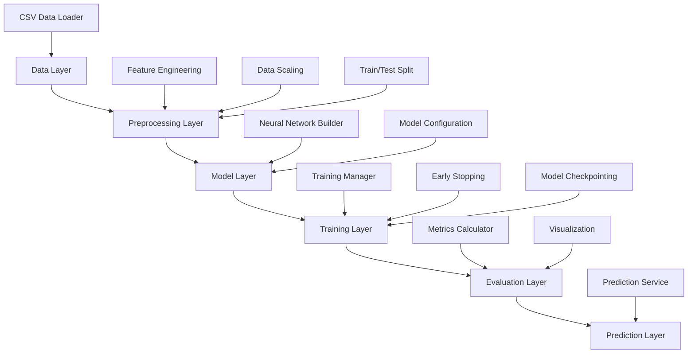

# Design Document

## Overview

The churn prediction system is designed as a modular machine learning pipeline using TensorFlow/Keras for binary classification. The system processes customer telecommunications data to predict churn probability using a feedforward neural network. The architecture follows object-oriented principles with clear separation of concerns for data processing, model management, training, and evaluation.

## Architecture

The system follows a layered architecture pattern:



## Components and Interfaces

### 1. ChurnDataProcessor
**Purpose:** Handles all data loading, cleaning, and preprocessing operations.

**Key Methods:**
- `load_data(file_path: str) -> pd.DataFrame`
- `preprocess_features(df: pd.DataFrame) -> Tuple[np.ndarray, np.ndarray]`
- `encode_categorical_features(df: pd.DataFrame) -> pd.DataFrame`
- `scale_numerical_features(X: np.ndarray) -> np.ndarray`
- `split_data(X: np.ndarray, y: np.ndarray) -> Tuple[np.ndarray, ...]`

**Responsibilities:**
- Load CSV data and handle missing values
- Encode categorical variables (State, International plan, Voice mail plan)
- Scale numerical features using StandardScaler
- Split data into training/validation/test sets (70/15/15 split)

### 2. ChurnModelBuilder
**Purpose:** Constructs and configures the neural network architecture.

**Key Methods:**
- `build_model(input_dim: int) -> tf.keras.Model`
- `compile_model(model: tf.keras.Model) -> tf.keras.Model`
- `get_model_summary() -> str`

**Architecture Design:**
- Input layer: matches feature count (19 features after preprocessing)
- Hidden layers: 3 dense layers with decreasing neurons (64, 32, 16)
- Activation: ReLU for hidden layers, Sigmoid for output
- Dropout: 0.3 after each hidden layer for regularization
- Output: Single neuron for binary classification

### 3. ChurnModelTrainer
**Purpose:** Manages the training process with monitoring and optimization.

**Key Methods:**
- `train_model(model: tf.keras.Model, X_train, y_train, X_val, y_val) -> tf.keras.callbacks.History`
- `setup_callbacks() -> List[tf.keras.callbacks.Callback]`
- `save_model(model: tf.keras.Model, path: str) -> None`

**Training Configuration:**
- Optimizer: Adam with learning rate 0.001
- Loss function: Binary crossentropy
- Metrics: Accuracy, Precision, Recall
- Batch size: 32
- Max epochs: 100
- Early stopping: patience=10, monitor='val_loss'
- Model checkpointing: save best model based on validation loss

### 4. ChurnModelEvaluator
**Purpose:** Provides comprehensive model performance assessment.

**Key Methods:**
- `evaluate_model(model: tf.keras.Model, X_test, y_test) -> Dict`
- `generate_classification_report(y_true, y_pred) -> str`
- `plot_confusion_matrix(y_true, y_pred) -> None`
- `plot_training_history(history: tf.keras.callbacks.History) -> None`
- `calculate_metrics(y_true, y_pred) -> Dict`

**Evaluation Metrics:**
- Accuracy, Precision, Recall, F1-score
- Confusion matrix visualization
- ROC curve and AUC score
- Training/validation loss and accuracy curves

### 5. ChurnPredictor
**Purpose:** Handles inference on new data using trained models.

**Key Methods:**
- `load_trained_model(model_path: str) -> tf.keras.Model`
- `predict_churn_probability(model: tf.keras.Model, X: np.ndarray) -> np.ndarray`
- `predict_churn_binary(model: tf.keras.Model, X: np.ndarray, threshold: float = 0.5) -> np.ndarray`
- `preprocess_new_data(df: pd.DataFrame) -> np.ndarray`

### 6. ChurnPredictionPipeline
**Purpose:** Orchestrates the entire machine learning workflow.

**Key Methods:**
- `run_full_pipeline(data_path: str) -> Dict`
- `train_pipeline(data_path: str) -> tf.keras.Model`
- `evaluate_pipeline(model: tf.keras.Model, test_data: Tuple) -> Dict`
- `predict_pipeline(model: tf.keras.Model, new_data: pd.DataFrame) -> np.ndarray`

## Data Models

### Input Data Schema
Based on the churn-bigml-80.csv dataset:

```python
@dataclass
class CustomerRecord:
    state: str                    # Categorical (50 states)
    account_length: int          # Numerical
    area_code: int               # Categorical (3 values)
    international_plan: str      # Binary (Yes/No)
    voice_mail_plan: str         # Binary (Yes/No)
    number_vmail_messages: int   # Numerical
    total_day_minutes: float     # Numerical
    total_day_calls: int         # Numerical
    total_day_charge: float      # Numerical
    total_eve_minutes: float     # Numerical
    total_eve_calls: int         # Numerical
    total_eve_charge: float      # Numerical
    total_night_minutes: float   # Numerical
    total_night_calls: int       # Numerical
    total_night_charge: float    # Numerical
    total_intl_minutes: float    # Numerical
    total_intl_calls: int        # Numerical
    total_intl_charge: float     # Numerical
    customer_service_calls: int  # Numerical
    churn: bool                  # Target variable
```

### Processed Data Schema
After preprocessing:
- Feature matrix X: (n_samples, 19) - numerical features after encoding
- Target vector y: (n_samples,) - binary labels (0: no churn, 1: churn)

### Model Output Schema
```python
@dataclass
class ChurnPrediction:
    customer_id: Optional[str]
    churn_probability: float     # 0.0 to 1.0
    churn_prediction: bool       # Binary classification
    confidence_level: str        # High/Medium/Low based on probability
```

## Error Handling

### Data Processing Errors
- **Missing CSV file:** Raise FileNotFoundError with clear message
- **Invalid CSV format:** Validate required columns and data types
- **Missing values:** Implement imputation strategies (mean for numerical, mode for categorical)
- **Data type mismatches:** Convert and validate data types with error logging

### Model Training Errors
- **Insufficient data:** Validate minimum dataset size (>1000 samples)
- **Training convergence issues:** Implement learning rate scheduling and gradient clipping
- **Memory errors:** Implement batch processing for large datasets
- **Model saving failures:** Validate write permissions and disk space

### Prediction Errors
- **Model loading failures:** Validate model file existence and format
- **Input validation:** Check feature count and data types match training data
- **Preprocessing errors:** Ensure same transformations as training data

### Configuration Management
```python
@dataclass
class ChurnPredictionConfig:
    # Data processing
    test_size: float = 0.15
    validation_size: float = 0.15
    random_state: int = 42
    
    # Model architecture
    hidden_layers: List[int] = field(default_factory=lambda: [64, 32, 16])
    dropout_rate: float = 0.3
    activation: str = 'relu'
    
    # Training parameters
    learning_rate: float = 0.001
    batch_size: int = 32
    max_epochs: int = 100
    early_stopping_patience: int = 10
    
    # Evaluation
    classification_threshold: float = 0.5
```

## Testing Strategy

### Unit Testing
- **Data Processing Tests:** Validate preprocessing functions with known inputs/outputs
- **Model Architecture Tests:** Verify model structure and parameter counts
- **Utility Function Tests:** Test helper functions for metrics calculation and visualization

### Integration Testing
- **Pipeline Tests:** Test end-to-end workflow with sample data
- **Model Training Tests:** Verify training process completes successfully
- **Prediction Tests:** Test inference pipeline with trained models

### Performance Testing
- **Training Time Tests:** Benchmark training duration with different data sizes
- **Memory Usage Tests:** Monitor memory consumption during training and inference
- **Accuracy Baseline Tests:** Ensure model meets minimum performance thresholds

### Data Validation Testing
- **Schema Validation:** Test data loading with various CSV formats
- **Edge Case Testing:** Handle empty datasets, single-class datasets, extreme values
- **Preprocessing Validation:** Verify feature scaling and encoding correctness

### Model Validation Testing
- **Cross-Validation:** Implement k-fold cross-validation for robust performance assessment
- **Overfitting Detection:** Monitor training/validation performance gaps
- **Feature Importance:** Analyze which features contribute most to predictions

The testing strategy ensures reliability, maintainability, and performance of the churn prediction system across all components and use cases.